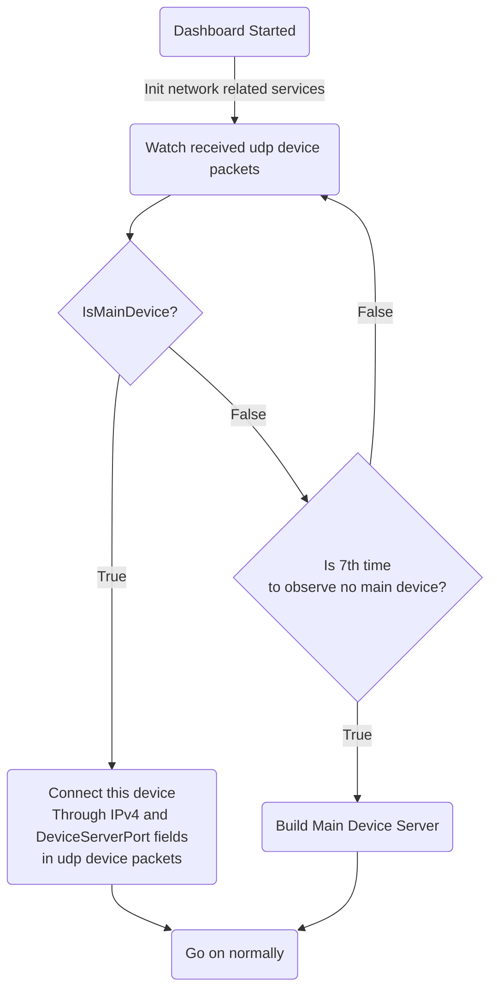

# Order of Execution

## Order of Execution of Dashboard

All the `Managers`, `Services` and source code in this process are in `KitX Dashboard/Services/`

1. Initialize EventBus (`EventHandlers`)
2. Process command line arguments
3. Check if there is another instance running to prevent multiple instances running at the same time
4. StartUp check
   1. Read configuration file, initialize configuration information (if it exists, read it, if not, initialize default configuration)
   2. Init log system, start logging
   3. Init global exception handler
   4. Init environment (read if it exists, create if not)
      1. Common.Algorithm
   5. Init database (read if it exists, create if not)
   6. Init task manager (`TasksManager`)
   7. Init network manager (`WebManager`)
   8. Init data record manager (`StatisticsManager`)
   9. Init event handlers (`EventHandlers`)
   10. Init file monitoring manager (`FileWatcherManager`)
5. Enter app lifetime loop, launch gui

## Network Initialization Process

- In the 4.7 step of `Dashboard Startup Process`, the actual code executed is:
  ```csharp
    #region Init WebManager

    Program.TasksManager.SignalRun(nameof(SignalsNames.MainWindowInitSignal), () =>
    {
        new Thread(() =>
        {
            Thread.Sleep(Program.Config.Web.DelayStartSeconds * 1000);
            Program.WebManager = new WebManager().Start();
        }).Start();
    });

    #endregion
  ```
  This task will be `Raise` after the `InitWindow()` function in `MainWindow.xaml.cs` is executed
  Then sleep for `Program.Config.Web.DelayStartSeconds` seconds before starting the network-related services
- `WebManager.Start()` Method will separately init `DevicesManager` , `DevicesServer` , `PluginsManager` and `PluginsServer`
- `DevicesServer` call `Start()` method, then start to broadcast device info struct udp pack, present as json serialized string of `DeviceInfoStruct` (This struct define in `KitX.Web.Rules`)
  At the same time, it will also listen to udp packets from the local area network multicast, and parse them into `DeviceInfoStruct` structures, and add them to the interface through the `DevicesManager.Update(DeviceInfoStruct)` method
- `PluginServer` will start listening for network connection requests after calling the `Start()` method, and establish a tcp connection with the requested plugin. After receiving a report starting with `"PluginStruct: "`, the remaining part is deserialized as a json string into a `PluginStruct` structure, and added to the interface through the `PluginsManager.Execute(string, IPEndPoint)` method

## Self-organizing network process

Based on the udp device packets sent continuously in the local area network, KitX Dashboard can easily determine the devices running KitX Dashboard in the local area network

Add tcp server related fields to the udp device packets, and you can automatically establish connections based on the udp device packets to form a network

Specific process: (View from the perspective of a device)



Sure, the observation process will not end after connecting to the main control or building the main control

This process will continue to observe, in order to prevent multiple devices in the network from establishing the main control at the same time

If you observe that the `DeviceServerBuildTime` field in the udp device packet of other main controls is earlier than the time when your main control service is established, you will actively close the server and restart the observation process

## Plugin Startup Process
1. Start Dashboard
2. User select to start plugin A
3. The instrument panel is based on the RootstartupFilename field in PluginStruct.json of the plug -in a and the loadErname field in LoaderStruct.json
   According to Loaders.installPath in config.json, the loader installation path is obtained, and LoaderName pieces can be executed to start the loader
   The parameter format is: `-load {file} --connect {address}: {port}` `
   1. `{file}` is the absolute path of the root startup file of the plugin
   2. `{address}` is the address connected to the current instrument panel to connect to the plugin (currently the internal network IPv4 address)
   3. `{port}` is the service port of the current dashboard communication server
4. After the Loader is started, set up a socket connection with the instrument panel. The address and port specified after the --connect parameter
   After the launch, Loader sends a text to the dashboard with the format: `pluginStruct: {ps}`, where `{ps}` is a JSON serialized pluginstruct object
