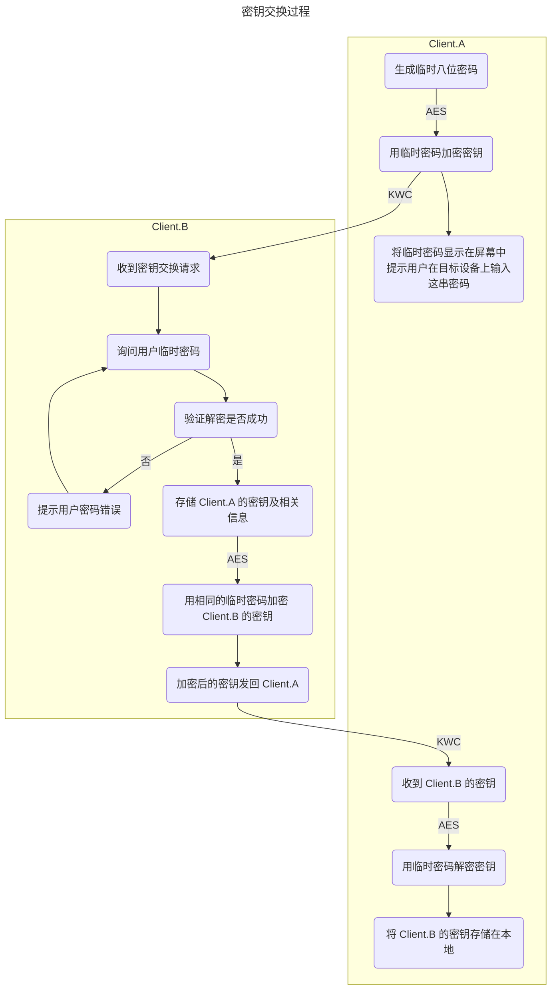

# KitX 加密环运作原理

1. 每个客户端在初次启动时生成一对 RSA 密钥对存储在本地
2. 用户需在设备页面选择新设备选择开始密钥交换过程来交换密钥
3. 本机 (A) 会弹窗显示一个临时的八位数字密码, 密钥信息使用 AES 加密后发送给目标设备 (B)
4. 目标设备 (B) 收到密钥信息后, 会弹窗提示用户输入临时密码, 输入正确后解密密钥信息并存储在本地
5. 目标设备 (B) 成功解密后, 会将自己的密钥信息使用相同的临时密码加密后发送给本机 (A)
6. 结束密钥交换过程
7. 之后新的设备和加密环中任何一个设备配对, 都将自动开始与其他加密环中所有设备交换密钥

## 密钥交换过程

