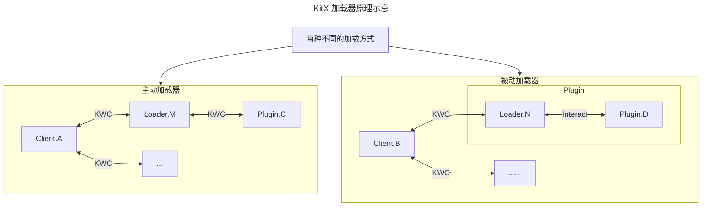

# KitX 加载器原理示意

```mermaid
---
title: KitX 加载器原理示意
---
flowchart TB
    两种不同的加载方式 --> 主动加载器
    两种不同的加载方式 --> 被动加载器

    subgraph 主动加载器
      Client.A <--> |KWC| Loader.M
      Client.A <--> |KWC| ...
      Loader.M <--> |KWC| Plugin.C
    end

    subgraph 被动加载器
      Client.B <--> |KWC| Loader.N
      Client.B <--> |KWC| ......
      subgraph Plugin
        Loader.N <--> |Interact| Plugin.D
      end
    end
```

更多详见 [KitX 加载器](../loader/README.md)

