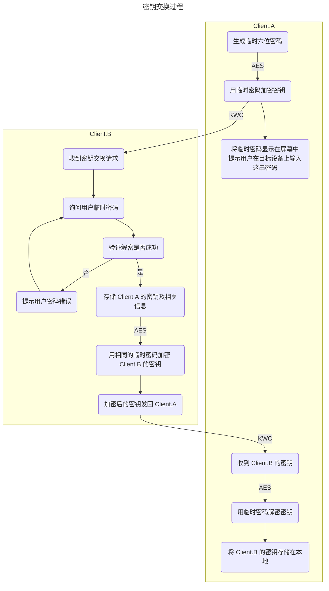

# KitX 加密环运作原理

1. 每个客户端在启用 "加密环" 时生成一对 RSA 密钥对存储在本地
2. 用户启用 "加密环" 后, 可手动添加要加密通信的目标设备 (目标设备也需启用 "加密环")
3. 若目标设备启用了 "加密环", 则开始密钥交换过程
4. 若目标设备未启用 "加密环", 则弹窗提示用户目标设备未启用 "加密环"

## 密钥交换过程

## 加密通信

对于已交换密钥的设备, 在 KWC 报文中设置 `IsEncrypted` 字段为 `True` 即可标记该报文启用了加密通信
并需随报文附带 `EncryptionKeyId` 字段以便目标设备能使用正确的密钥解密报文

`EncryptionKeyId` 由密钥提供方提供, 且在密钥交换过程中已经交换, 其值为密钥的 SHA256 哈希值

