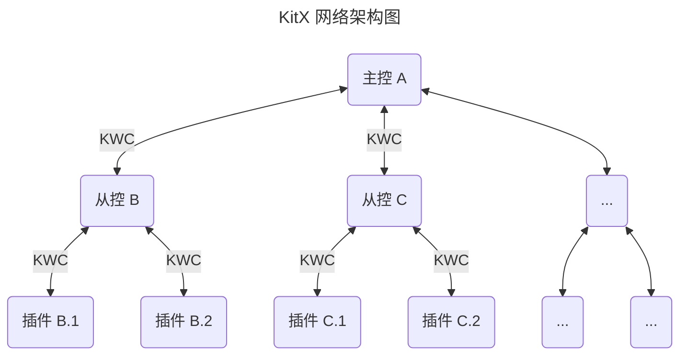

# KitX 网络架构

```mermaid
---
title: KitX 网络架构图
---
graph TB
  A(主控 A) <--> |KWC| B(从控 B)
  A <--> |KWC| C(从控 C)

  B <--> |KWC| E(插件 B.1)
  B <--> |KWC| F(插件 B.2)
  C <--> |KWC| G(插件 C.1)
  C <--> |KWC| H(插件 C.2)

  A <--> D(...)
  D <--> I(...)
  D <--> J(...)
```

如图所示，KitX 网络由主控、从控和插件组成。

主控从控均为 KitX 客户端，且主从控之间使用 KWC 协议进行通信。

客户与插件（主要是 Loader）之间也使用 KWC 协议进行通信。
